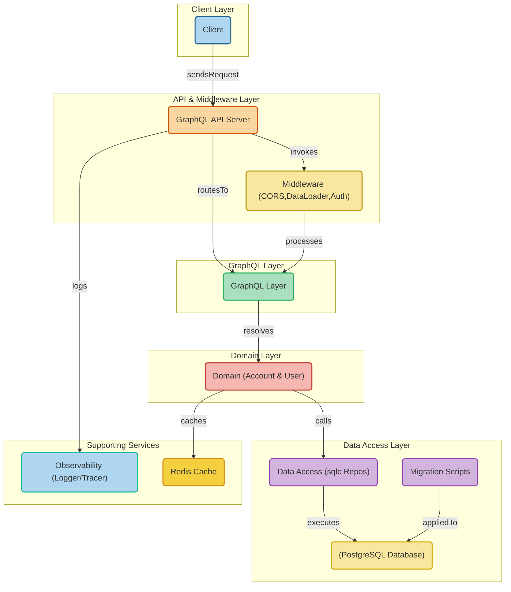

# Graphql golang




## Middleware
- [x] CORS
- [x] DataLoader - solving the N+1 problem
- [x] Authorization - validates JWT tokens

## Observability
- [x] Logging - logging with correlation id, and also ease of integration with Jaeger for tracing

## Reliability
- [x] Graceful shutdown - signals termination to running processes (Database connections, redis connections, background worker etc) before shutting down the server
- [x] Retry database connection - attempts to reconnect to database if fails

## Database
- [x] Transactions - operations with transactions possible
- [x] Code generation - using sqlc package to generate repository layer


## Tests Assertions
- using goconvey and testify suite/assertions

https://github.com/smartystreets/goconvey/wiki/Assertions


## Pre-commit
To enable, change the `.git/hooks/pre-commit`:
```
#!/bin/sh

sh scripts/pre-commit.sh
[ $? -ne 0 ] && exit 1;
exit 0;
```
